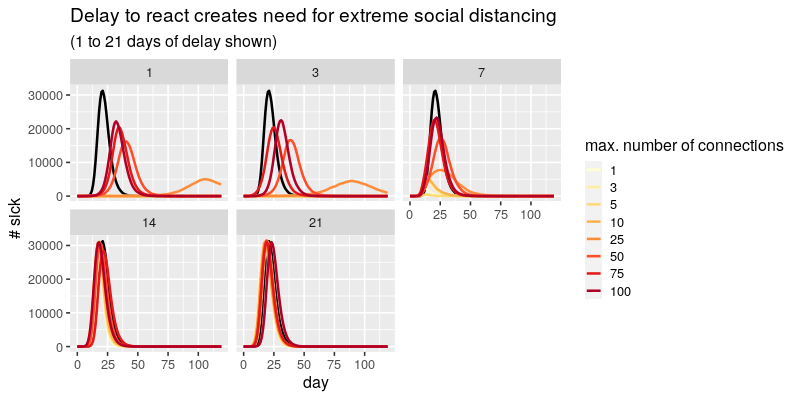

# rhinoceros

This is an ad-hoc repos to illustrate and experiment with code and data what the next weeks might look like...

This should work on Colab: https://colab.research.google.com/github/lgautier/rhinoceros/blob/master/flat%20curver.ipynb
